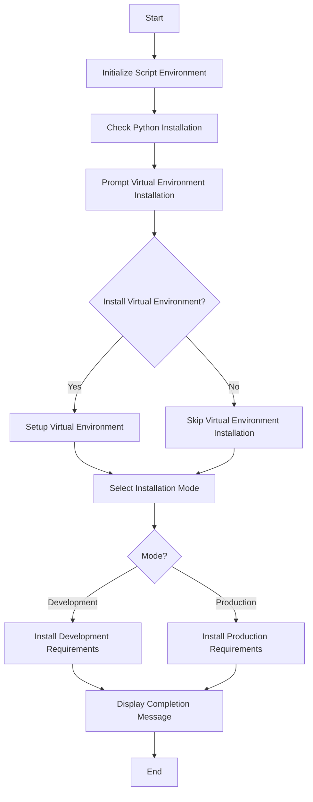

# FastAPI Enterprise Installation Script

## Installation Guide

### 1. Windows Installation

1. Ensure Python 3.8 or higher is installed on your system

2. Clone this repository:

   ```bash
   git clone https://github.com/StrideIT/FastAPI-Setup.git
   cd FastAPI-Setup
   ```

3. Configure Installation Path:
   - Open `install/windows/variables.ps1`
   - Update the `$rootDir` variable with your desired installation path:

     ```powershell
     # Example:
     $rootDir = "D:\projects\my_fastapi_project"  # Change this to your preferred path
     ```

   - The script will validate this path and offer to create it if it doesn't exist

4. Run the installation script:

   ```powershell
   cd install/windows
   . .\setup.ps1 
   ```

   The script will guide you through:
   - Virtual environment setup (optional)
   - Development/Production mode selection
   - Required packages installation

### 2. Linux Installation

Coming soon! The Linux installation script is currently under development and will be available in future releases.

---

## Project Overview

This repository contains PowerShell scripts for installing the FastAPI framework with development and production mode options. The scripts handle virtual environment creation, package installation, and environment configuration.

## Project Versions

### 1. Windows (Completed)

The Windows version of the installation script is located in the `install/windows` directory. It includes the following features:

- Virtual environment creation and activation
- Development/Production mode selection
- Automated package installation
- Error handling and validation

### 2. Linux/Unix (In Progress)

The Linux/Unix version of the installation script is currently in progress and will be added to the `install/linux` directory once completed.

## Usage

To run the Windows script, execute the following command in the `install/windows` directory:

```powershell
. .\setup.ps1 
```

## Script Details

The Windows script is divided into several steps, each handled by a separate PowerShell file in the `steps` folder:

1. **Configuration**: Sets up common variables like the project root directory and Python path.
2. **Initialize Script Environment**: Prepares the environment for installation.
3. **Check Python Installation**: Verifies if Python is installed and retrieves the path to the Python executable.
4. **Prompt Virtual Environment Installation**: Prompts the user to choose whether to install and activate a virtual environment.
5. **Setup Virtual Environment**: Creates and activates the virtual environment.
6. **Install Requirements**: Installs the required packages based on the selected mode (development or production).
7. **Display Completion Message**: Displays a completion message with server configuration details.

## Script Flow



## Steps Folder

The `steps` folder contains the following files:

- `banner.ps1`: Displays the installation script banner and welcome message.
- `check_python_installation.ps1`: Checks if Python is installed and retrieves the path.
- `completion_message.ps1`: Displays a completion message with server configuration details.
- `config.ps1`: Configuration file for storing common variables.
- `initialize_script_environment.ps1`: Initializes the script environment.
- `install_requirements.ps1`: Installs the required packages based on the selected mode.
- `prompt_venv_installation.ps1`: Prompts the user to choose whether to install and activate a virtual environment.
- `setup_virtual_environment.ps1`: Creates and activates the virtual environment.
- `venv_setup.ps1`: Contains virtual environment setup helper functions.

## Future Plans

This project will be extended to have FastAPI Enterprise installation ready to use. The Linux/Unix version of the installation script is currently in progress and will be added soon.

## License

This project is licensed under the MIT License.

## Author

Tariq Ahmed - [t.ahmed@stride.ae](mailto:t.ahmed@stride.ae)
