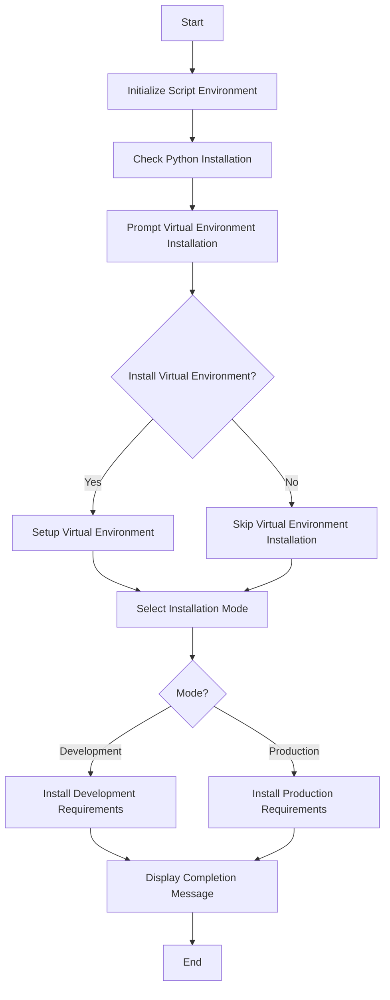

# FastAPI Enterprise Setup - Windows Installation

## Quick Start Guide

1. Ensure Prerequisites:
   - Python 3.8 or higher installed and added to PATH
   - PowerShell 5.1 or later

2. Clone the repository:

   ```bash
   git clone https://github.com/StrideIT/FastAPI-Setup.git
   cd FastAPI-Setup
   ```

3. Configure Installation Path:
   - Open `variables.ps1` in the windows directory
   - Locate and update the `$rootDir` variable:

     ```powershell
     # Example: Change this to your preferred installation path
     $rootDir = "D:\projects\my_fastapi_project"
     ```

   - The script will validate this path and offer to create it if it doesn't exist
   - All other paths (venv, requirements) will be created relative to this root directory

4. Navigate to Windows installation directory:

   ```bash
   cd install/windows
   ```

5. Run the setup script:

   ```powershell
   . .\setup.ps1
   ```

The script will guide you through:

- Virtual environment setup (optional)
- Development/Production mode selection
- Required packages installation

## Detailed Installation Steps

### Step 1: Python Installation

- Download Python 3.8 or higher from [python.org](https://www.python.org/downloads/)
- During installation, ensure "Add Python to PATH" is checked
- Verify installation by opening PowerShell and running:

  ```powershell
  python --version
  ```

### Step 2: Repository Setup

1. Clone the repository:

   ```bash
   git clone https://github.com/StrideIT/FastAPI-Setup.git
   ```

2. Configure Your Installation:
   - Locate `variables.ps1` in the windows directory
   - This file contains all configuration settings
   - The most important setting is `$rootDir`, which defines where your project will be installed
   - Update it to your preferred location:

     ```powershell
     # In variables.ps1
     $rootDir = "D:\projects\my_fastapi_project"  # Change this path
     ```

   - The script includes path validation and will:
     - Check if the path exists
     - Verify parent directories
     - Offer to create missing directories
     - Validate the path is writable

3. Navigate to the project directory:

   ```bash
   cd FastAPI-Setup/install/windows
   ```

### Step 3: Script Execution

1. Open PowerShell in the windows directory
2. Run the setup script:

   ```powershell
   . .\setup.ps1
   ```

3. Follow the interactive prompts to complete installation

## Features

- Virtual environment creation and activation
- Development/Production mode selection
- Automated package installation
- Error handling and validation
- Comprehensive setup instructions

## Script Details

The setup process is divided into several steps, each handled by a separate PowerShell file in the `steps` folder:

1. **Configuration**: Sets up common variables like the project root directory and Python path.
2. **Initialize Script Environment**: Prepares the environment for installation.
3. **Check Python Installation**: Verifies if Python is installed and retrieves the path to the Python executable.
4. **Prompt Virtual Environment Installation**: Prompts the user to choose whether to install and activate a virtual environment.
5. **Setup Virtual Environment**: Creates and activates the virtual environment.
6. **Install Requirements**: Installs the required packages based on the selected mode (development or production).
7. **Display Completion Message**: Displays a completion message with server configuration details.

## Script Flow



## Steps Folder Structure

The `steps` folder contains the following files:

- `banner.ps1`: Displays the installation script banner and welcome message.
- `check_python_installation.ps1`: Checks if Python is installed and retrieves the path.
- `completion_message.ps1`: Displays a completion message with server configuration details.
- `config.ps1`: Configuration file for storing common variables.
- `initialize_script_environment.ps1`: Initializes the script environment.
- `install_requirements.ps1`: Installs the required packages based on the selected mode.
- `prompt_venv_installation.ps1`: Prompts the user to choose whether to install and activate a virtual environment.
- `setup_virtual_environment.ps1`: Creates and activates the virtual environment.
- `venv_setup.ps1`: Contains virtual environment setup helper functions.

## Troubleshooting

If you encounter any issues during installation:

1. Ensure Python is correctly added to PATH
2. Run PowerShell as Administrator if you encounter permission issues
3. Check that all prerequisites are met
4. Verify you're in the correct directory when running the script

## License

This project is licensed under the MIT License.

## Author

Tariq Ahmed - [t.ahmed@stride.ae](mailto:t.ahmed@stride.ae)
